# TD_mapping_FR

**Créer pour le mapping dans TouchDesigner**

## Introduction

L'[Introduction à Touchdesigner](https://github.com/LucieMrc/IntroTD_FR).

L'[Introduction à Madmapper](https://github.com/LucieMrc/Madmapper_2spi).

## Faire apparaître les contours

Prendre une photo de l'objet à mapper.

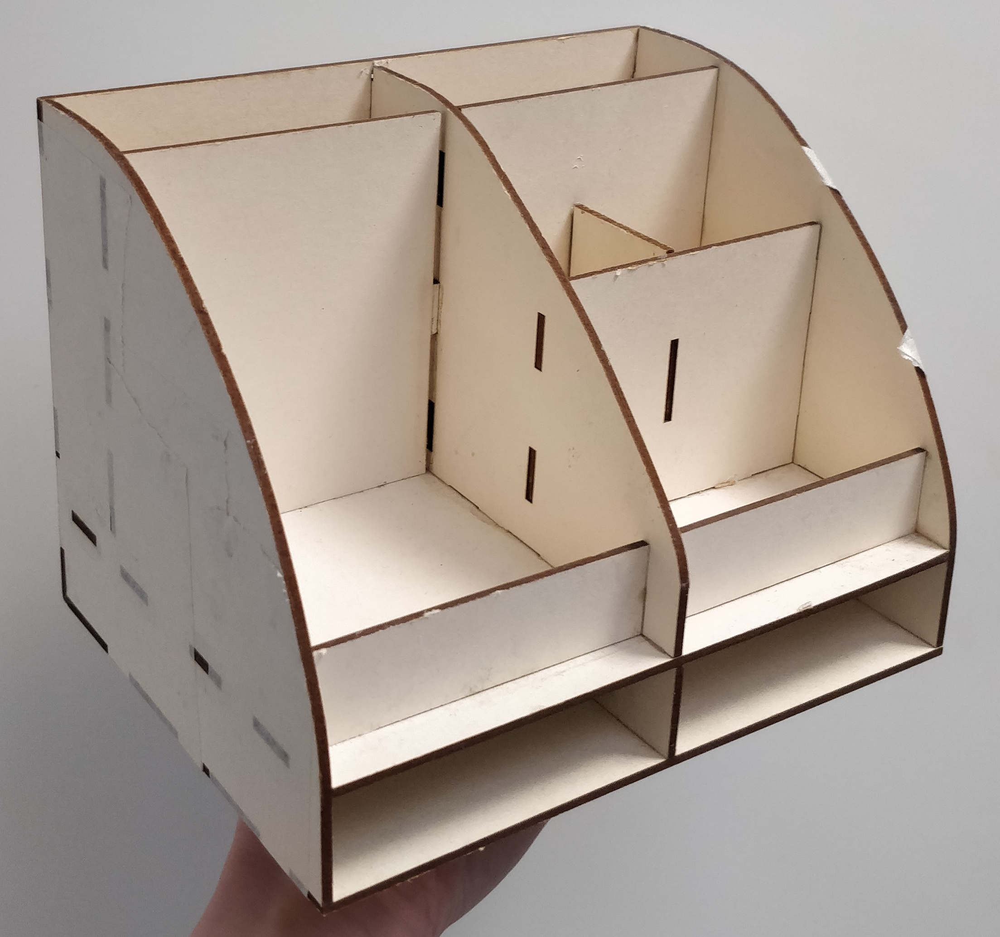

L'ouvrir dans TD avec `Movie File In` TOP.

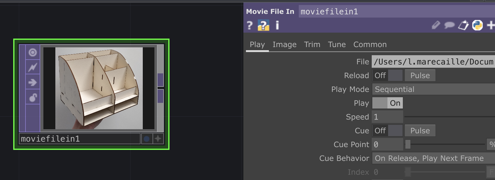

Créer à la suite un `Level` TOP, et créer du contraste avec les différents paramètres.

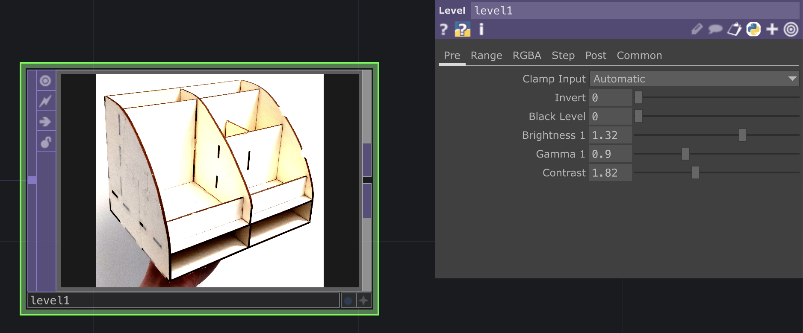

Créer un `Edge` TOP, et ajuster les paramètres jusqu'au résultat désiré.

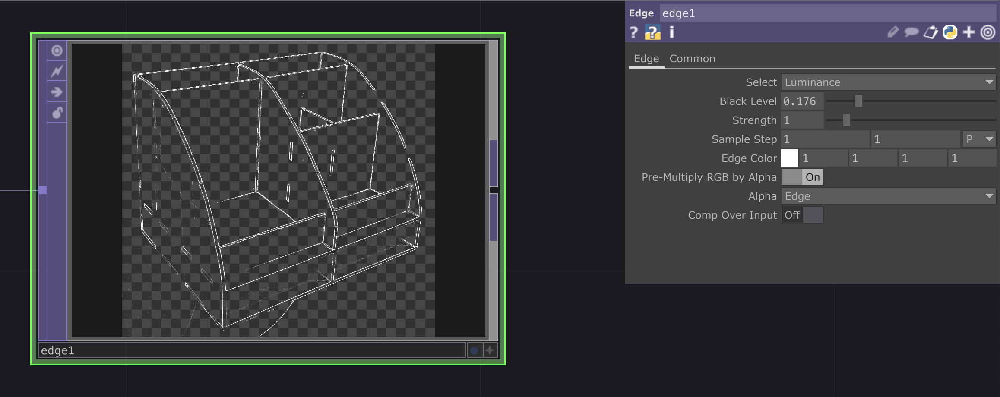

## Animer les contours

Créer un `Ramp` TOP et animer la Phase avec "absTime.seconds".

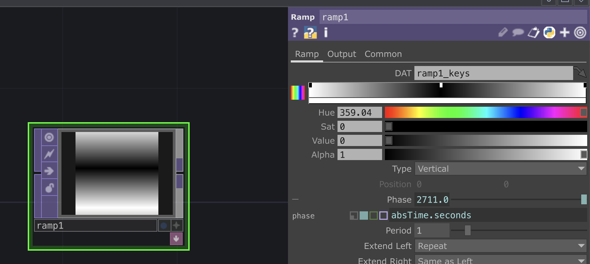

Créer un `Composite` TOP et y combiner le `Edge` et le `Ramp`.

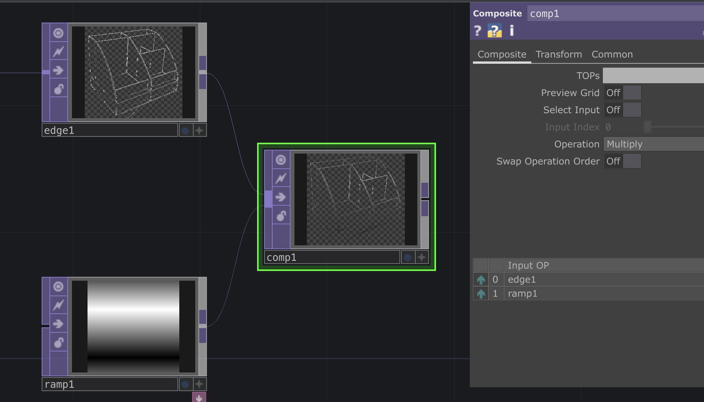

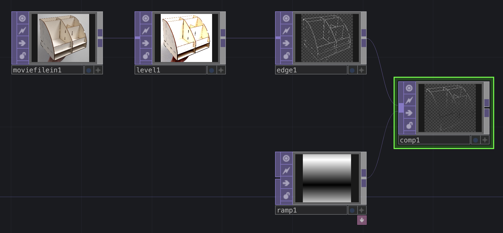

## Masquer et faire apparaître des zones

Combiner le motif et le masque dans un `Composite` TOP, en utilisant l'opération Multiply, Burn Linear, Darker Color, Dimmest ou Minimum.

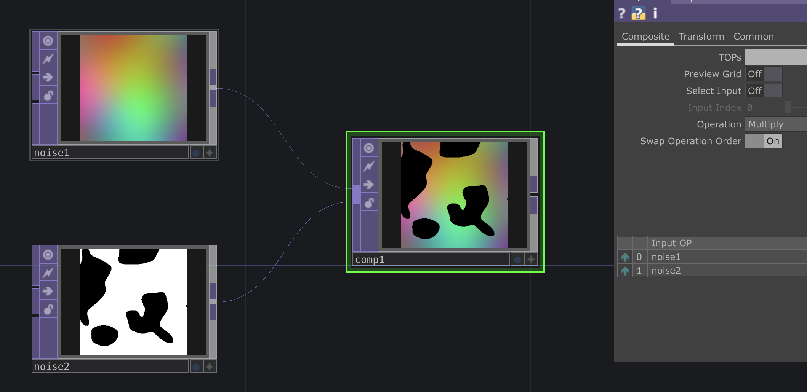

Pour inverser le masque, on peux utiliser un `Level` TOP et mettre 1 au paramètre "Invert".

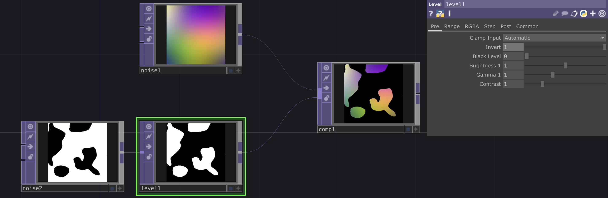

Pour rendre la partie noire transparente, ajouter un `Chroma Key` TOP, aller dans l'onglet "Val" et mettre 0.01 au paramètre "Val Min".

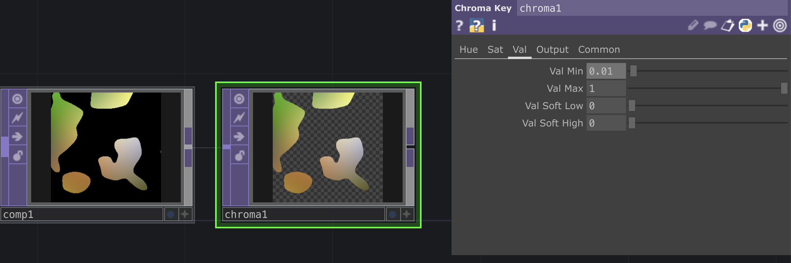

## Export / video temps réel

Pour exporter une vidéo en .mov : créer un `Movie File Out` TOP à la toute fin du network, choisir un nom et une dossier d'enregistrement pour le fichier dans l'encart "File". Pour commencer à enregistrer, il suffit d'acord le bouton "Record" dans les paramètres et le désactiver pour arrêter d'enregistrer.

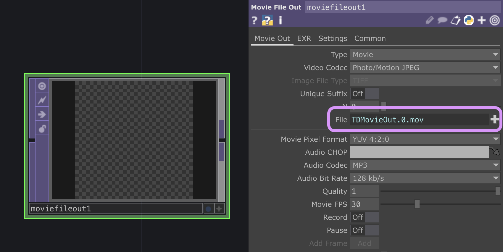

Il faut décocher le bouton "Realtime" au milieu du menu en haut, pour que la vidéo ne perdent pas en qualité si Touchdesigner lag un peu.

Pour envoyer la vidéo sur un media server en temps réel ou pour l'envoyer vers MadmApper, il faut installer [Syphon](https://github.com/Syphon/Simple/releases) (sur mac) ou [Spout](https://leadedge.github.io/) (sur windows).

Il suffit ensuite de créer un `Syphon/Spout Out` TOP à la toute fin du network.

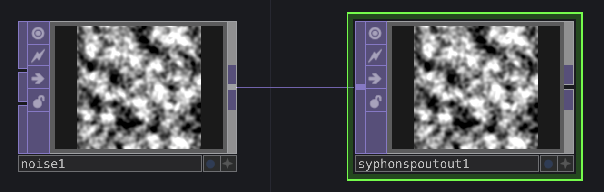

On voit ensuite apparaître la video dans les textures de Madmapper.

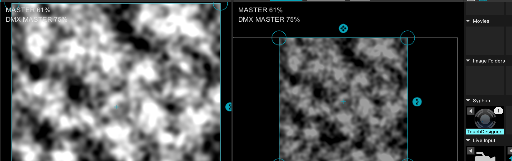

# Pour aller + loin

- [Visuels Audioreactifs avec TD (FR)](https://github.com/LucieMrc/TD_audioreact_love)

- [Text effects in TD (EN)](https://github.com/LucieMrc/TD_textEffects)